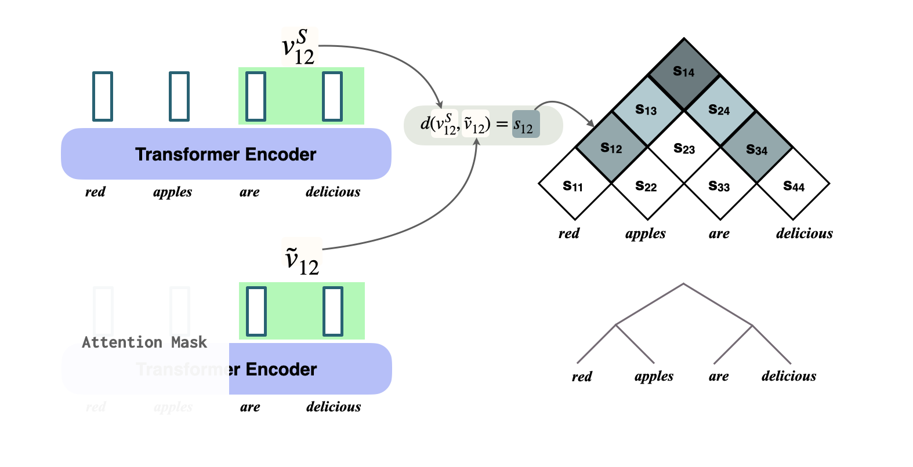

# Tree Projections

<p align="center">
  
</p>


This is an implementation of the tree projections method from our ICLR 2023 paper:
[Characterizing Intrinsic Compositionality in Transformers with Tree Projections](https://openreview.net/pdf?id=sAOOeI878Ns)


## Dependencies:
Note that this code has been tested with `python 3.8.10`.
1. Install conda environment: 

```
conda env create -f environment.yml
conda activate tree-reg
pip install -e .
```

## Data:
Datasets used in this work can be found under data_utils. More specificially, `data_utils/cogs` contains COGS and `data_utils/m-pcfgset` contains the modified PCFGSET dataset.

## Training
The script in `train_transformers.py` may be used to train transformers of various sizes. Below are commands for training a 4 layer transformer encoder (with a 2 layer decoder) on COGS
```
# checkpoints saved under /path/to/save/dir
python train_transformers.py --dataset cogs --save_dir /path/to/save/dir --encoder_depth 6
```
To modify number of training steps / checkpoint saving frequency, please take a look at `trainin_utils.py`.


## Computing Tree Projections
The script in `run_tree_projections.py` may be used to compute tree projections. Below are commands for evaluating `checkpoint_10000.pickle`:

```
# run tree projection for the checkpoint ckpt.pickle
python run_tree_projections.py --model_path /path/to/save/dir/checkpoint_10000.pickle --encoder_depth 6 --data cogs
```

You should observe that as the model trains, the tree projection score should go up (i.e. increased tree structuredness). For COGS, you should also see find that projected trees get closer to ground truth syntax trees (in `data_utils/COGS_TREES`).

## Misc Experiments 
To train a probe to recover syntax trees from checkpoints, run:
```
# train a probe (a transformer decoder) to recover linearized parse trees from a fixed encoder 
python syntax_probe.py --model_path /path/to/save/dir/checkpoint_10000.pickle --encoder_depth 6 --data cogs 
```
You should observe that the parseval score of decoded parse trees from the probe goes up as the model trains, but quicky saturates.


## Citing this work
If you use tree projections in your work, we kindly ask you to cite our ICLR paper:
```
@inproceedings{
murty2023characterizing,
title={Characterizing intrinsic compositionality in transformers with Tree Projections},
author={Shikhar Murty and Pratyusha Sharma and Jacob Andreas and Christopher D Manning},
booktitle={The Eleventh International Conference on Learning Representations },
year={2023},
url={https://openreview.net/forum?id=sAOOeI878Ns}
}
```


## Acknowledgements
A lot of our code is built on top of the following repository:
- [The Devil is in the Detail: Simple Tricks Improve Systematic Generalization of Transformers](https://github.com/RobertCsordas/transformer_generalization)

